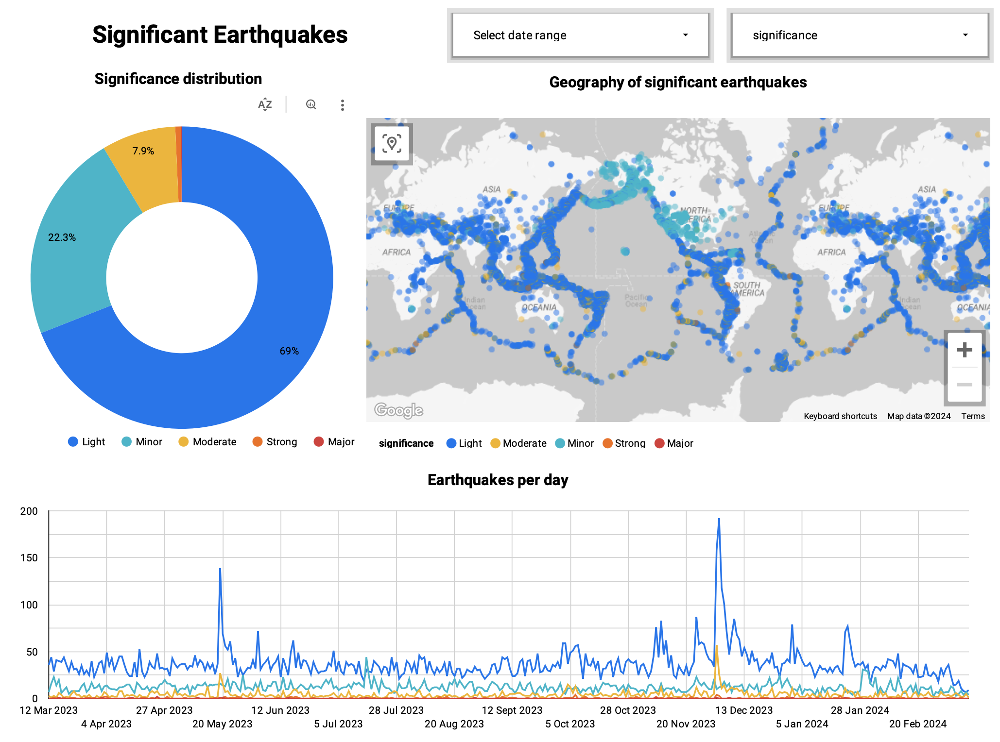
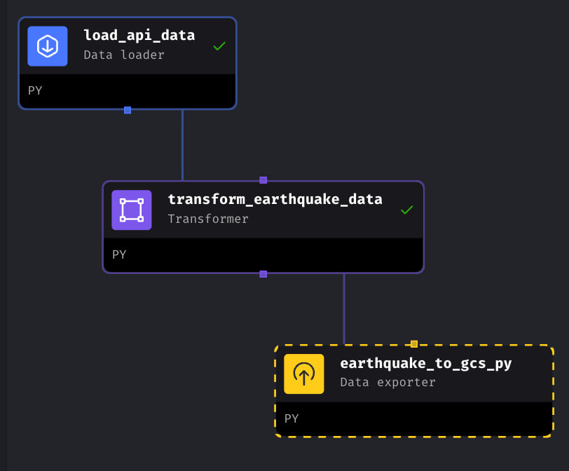
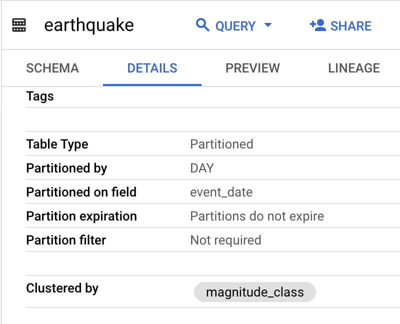
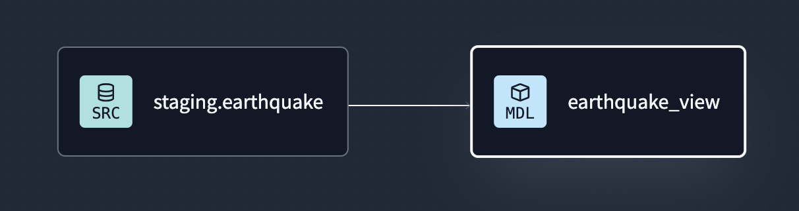

# Earthquake Analytics Dashboard
####[Data Engineering Zoomcamp 2024.](https://github.com/DataTalksClub/data-engineering-zoomcamp) Final Project Report

[Earthquake Analytics Dashboard](https://lookerstudio.google.com/s/pS2-9oeprHo)  
<a href="https://lookerstudio.google.com/s/pS2-9oeprHo"></img></a>

##1. Project Description

###1.1. Project Goal

The objective of this project is to apply the concepts and technologies learned throughout the data engineering course to construct a comprehensive data pipeline. 
Specifically, the project aims to create a dashboard by implementing various data engineering techniques, including data ingestion, processing, storage, transformation, and visualization.

###1.2. Project Tasks
To accomplish the project, the following tasks had to be done:
- Selecting an appropriate dataset
- Organizing cloud infrastructure using Infrastructure as Code (IaC) principles
- Building a pipeline for processing this dataset and putting it into a data lake
- Building a pipeline for moving the data from the lake to a data warehouse
- Transforming the data in the data warehouse: preparing it for the dashboard
- Building a dashboard to visualize the data

###1.3 Technologies used
- Cloud: **Google Cloud Platform (GCP)**
- Infrastructure as Code (IaC): **Terraform**
- Workflow Orchestration: **Mage**
- Data Warehouse: **BigQuery**
- Data Transformation: **dbt**
- Data Visualisation: **Google Looker Studio**

##2. Project results
###2.1. Dataset Selection
The project began with the selection of the [Earthquake Catalog API](https://earthquake.usgs.gov/fdsnws/event/1) provided by the Earthquake Hazards Program, U.S. Geological Survey as a datasource.  
This API was chosen due to its provision of real-time earthquake data, aligning with the project's objectives. 

###2.2. Organizing Cloud Infrastructure using Infrastructure as Code (IaC) Principles
To ensure efficient management of cloud infrastructure, cloud resources were organized and provisioned using Infrastructure as Code (IaC) principles and Terraform with Terraform. By codifying infrastructure configurations, it was ensured that the infrastructure setup was consistent, reproducible, and easily scalable across different environments. 

###2.3. Data Ingestion (Batch / Workflow Orchestration)
A comprehensive pipeline was developed for data ingestion and processing. Workflow orchestration was handled by Mage, automating data processing tasks and coordinating pipeline stages seamlessly. 
The pipeline consists of the following stages:
- data ingestion,
- data processing,
- exporting data to a Data Lake (Google Cloud Storage Bucket).

</img>

### 2.4. Moving data to Data Warehouse. Clustering and Partitioning
Following data processing and storage in the data lake, the next stage involved transferring the data to a data warehouse. 
Earthquake Data has been moved from the data lake to BigQuery.

#### Partitioning and Clustering in BigQuery
The table in BigQuery was partitioned and clustered to optimize query performance.  
- **Partitioning** the data by the Event (Earthquake) Date field allows the analytic dashboard to efficiently handle time-based analysis, such as trend analysis over periods (e.g., daily, monthly, or yearly trends). By partitioning the data, queries filtering by date can target specific partitions, reducing the amount of data scanned and improving query performance.
For the dashboard, this means that time-based visualizations, such as line charts or time series plots, can load and render quickly due to the optimized data retrieval process. Users can interact with the dashboard seamlessly, exploring historical trends and patterns without experiencing significant delays.  
- **Clustering** the data by the Earthquake Significance field (magnitude_class) allows the dashboard to efficiently group and filter earthquake data based on significance levels. This clustering optimizes the physical organization of data within each partition, reducing the amount of data scanned when filtering or aggregating by earthquake significance.
In the dashboard, users may have filters or groupings based on earthquake significance levels (e.g., major earthquakes, minor earthquakes). By leveraging clustering, these operations can execute swiftly, enhancing the responsiveness of the dashboard. Users can dynamically explore earthquake data across different significance levels without encountering performance bottlenecks.

</img>

###2.5. Data Transformation in Data Warehouse
In the data transformation stage of the project, the focus was on converting the raw data stored in the Data Warehouse (DWH) into an analytical view. This transformation process was facilitated by developing a project using dbt. With dbt, transformation logic is articulated using a modeling language that is essentially SQL but includes specialized features unique to dbt. Within this framework, transformation logic is embodied in models, which are SQL queries designed to refine and structure the raw data, making it primed for analysis and visualization purposes. This step ensures that the data is optimized and prepared for further insights and decision-making processes.  
</img>

###2.6. Dashboard Creation
Utilizing Google Data Studio, a visually appealing and interactive dashboard was crafted to visualize insights derived from the processed earthquake data.  
[The Dashboard](https://lookerstudio.google.com/s/pS2-9oeprHo) is created with two tiles:
- a graph illustrating the distribution of earthquake magnitudes;
- a temporal line graph displaying the frequency of earthquakes over time.  
BigQuery served as the backend data source, providing real-time access to the transformed data. Leveraging Data Studio's intuitive interface, dynamic visualizations such as a pie chart, a line chart, and a map were created, enabling users to explore earthquake patterns and trends effortlessly.

##4. Reproducibility
To reproduce the data design pipeline, follow the instructions:

###4.1. Clone the git repository:
`git clone git@github.com:suparshukov/earthquake-analytics-dashboard.git`

###4.2. IoC (Terraform)

Setup Environment:
- Create a service account (“terraform-runner”)
- Grant this service account access to project: Cloud Storage - Storage Admin, BigQuery - BigQuery Admin, Compute Engine - Compute Admin
- Create a key (Manage keys) for the service account and download it.
- Export you key on your local machine: `export GOOGLE_APPLICATION_CREDENTIALS="{path_to_key}/my-creds.json"`
- Enable API’s: 
    - Identity and Access Management (IAM) API
    - IAM Service Account Credentials API

- Open a terminal or command prompt and navigate to the directory containing Terraform configuration files (/IaC-Terraform) and run the instructions:  
  - `terraform init` to initialize Terraform. This command downloads the necessary providers and modules specified in your configuration files
  - `terraform plan` to preview the changes Terraform will make to your infrastructure based on the configuration. Review the plan to ensure it matches your expectations
  - `terraform apply` to apply the changes by running terraform apply. Terraform will prompt you to confirm the changes before proceeding. Once confirmed, Terraform will provision the resources defined in your configuration

- If you no longer need the resources, you can destroy them using `terraform destroy`.


###4.3. Data ingestion (Mage)

- Set /data-ingestion-mage as the current working directory: `cd /data-ingestion-mage`  
- Edit docker-compose.yml to set the path to your Google application credentials file (personal-gcp.json)  
- Build an image for each service defined in docker-compose.yml (Mage, PostgreSQL): `docker-compose build`
- Start the Docker containers defined in docker-compose.yml file (Mage, PostgreSQL): `docker-compose up`
- Open the link http://localhost:6789/pipelines
- Go to the api_to_gcs pipeline and run it  
The pipeline consists of three steps: loading data from API, transforming data, and exporting data to Google Cloud Storage:
  - `data-ingestion-mage/earthquake_data_ingestion/data_loaders/load_api_data.py`
  - `data-ingestion-mage/earthquake_data_ingestion/transformers/transform_earthquake_data.py`
  - `data-ingestion-mage/earthquake_data_ingestion/data_exporters/earthquake_to_gcs.py`

###4.4. Data warehouse (BigQuery)
To load data from data lake to DWH (BigQuery), run two queries from `dwh/queries.sql` in BigQuery.
The first script creates an External Table based on the files from the bucket (GCS), and the second one creates a table in BigQuery partitioned and clustered.

###4.5. Transformations (dbt)
Follow these instructions to perform a data transformation that will create an analytical view of earthquake data:
- To use the dbt transformation project, you need to place the project from the transformations-dbt folder in your git repository
- Then create an account at https://cloud.getdbt.com/ and link to the repository following the [Guide](https://docs.getdbt.com/guides/bigquery).
- Then run these commands in the dbt Cloud interface to perform the data transformation:  
  ```
  dbt compile
  dbt build --vars '{'is_test_run': 'false'}'
  dbt apply
  ```

##Conclusion
By following these stages and integrating the mentioned technologies into the project workflow, a comprehensive data pipeline for earthquake data analysis was developed.  
Leveraging the scalability, flexibility, and reliability of GCP's cloud services, alongside Terraform for infrastructure automation, Mage for workflow orchestration, dbt for data transformation, and BigQuery for data warehousing and analytics, the project successfully achieved its objectives.

The dashboard is available at the [link](https://lookerstudio.google.com/s/pS2-9oeprHo).
